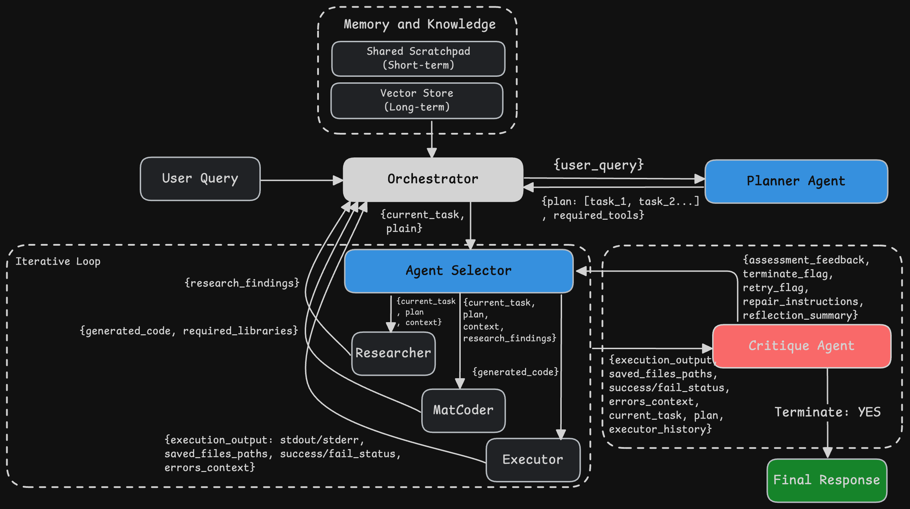

# OctCoder: Open-source AI Agents for GNU Octave Simulations



## Project Overview

OctCoder is an Agentic framework to streamline the creation and execution of simulations using GNU Octave. It provides a natural language interface, allowing users to describe desired simulations, which are then interpreted, coded, executed, and summarized by a series of interconnected AI agents. The project features a user-friendly Gradio web interface for easy interaction.

## Features

*   **Natural Language to Simulation:** Describe your simulation needs in plain English, and OctCoder will handle the rest.
*   **Intelligent Agentic Pipeline:** A robust LangGraph-powered pipeline orchestrates specialized AI agents for chat, interpretation, code generation, execution, and summarization.
*   **GNU Octave Integration:** Seamlessly generates and executes `.m` scripts within a GNU Octave environment.
*   **Visual Output:** Supports generating animated GIFs from simulation results for better understanding.
*   **Interactive Gradio Interface:** A web-based UI for easy input, real-time progress updates, and display of results.


## Project Structure

```bash
.
├── agents/ # Contains individual AI agents for the LangGraph pipeline
│ ├── chat_agent.py # Handles initial user interaction and acknowledgement.
│ ├── codegen.py # Generates GNU Octave (.m) scripts from interpreted specifications.
│ ├── executor.py # Executes Octave scripts and captures output (stdout, stderr, frames, GIF).
│ ├── interpreter.py # Interprets user requests into a structured simulation specification (JSON).
│ └── summariser.py # Summarizes simulation results and generates a markdown response.
├── prompts/ # Stores prompt templates for the large language models (LLMs)
├── tools/ # Utility functions and scripts used by agents (e.g., Octave runner, GIF maker)
├── gradio_app.py # The main Gradio application interface.
├── main.py # Command-line interface to run the agentic pipeline.
├── requirements.txt # Python dependencies for the project.
├── vercel.json # Vercel deployment configuration.
├── README.md # Project README file.
├── LICENSE # The AGPL-3.0 Community License.
├── ENTERPRISE_LICENSE.txt # The Commercial License terms.
└── CLA.md # The Contributor License Agreement.
```

## How It Works: The Agentic Pipeline

OctCoder utilizes a sophisticated agentic pipeline built with LangGraph to process user requests:

1.  **Chat Agent (`chat_agent.py`):**
    *   **Role:** The entry point for user interaction. It receives the initial natural language request.
    *   **Functionality:** Engages in a preliminary conversation, acknowledges the user's input, and forwards the cleaned-up request for interpretation.

2.  **Interpreter Agent (`interpreter.py`):**
    *   **Role:** Translates the user's natural language request into a structured, machine-readable simulation specification.
    *   **Functionality:** Uses an LLM to parse the request and generate a JSON object (`SimulationSpec`) detailing the simulation's task, desired outputs (e.g., GIF), and parameters.

3.  **Code Generation Agent (`codegen.py`):**
    *   **Role:** Creates the executable GNU Octave `.m` script based on the interpreted simulation specification.
    *   **Functionality:** Takes the JSON `spec` from the interpreter and generates a complete Octave script that performs the requested simulation.

4.  **Executor Agent (`executor.py`):**
    *   **Role:** Runs the generated GNU Octave script and captures all relevant outputs.
    *   **Functionality:** Executes the `.m` script in a dedicated environment, collects standard output, standard error, generated plot frames (if any), and optionally creates an animated GIF from the frames.

5.  **Summariser Agent (`summariser.py`):**
    *   **Role:** Provides a comprehensive and human-readable summary of the simulation results.
    *   **Functionality:** Analyzes the simulation specification, Octave's outputs, and any generated artifacts (like GIFs) to generate a detailed markdown response for the user.

This sequence of agents forms a robust chain, ensuring that each step of the simulation creation and execution process is handled intelligently and efficiently.


## Usage

### Via Gradio Web Interface
To run the Gradio app on your local machine:

1.  **Clone the repository:**
    ```bash
    git clone https://github.com/simworks-ai/OctCoder.git
    cd OctCoder
    ```
2.  **Install dependencies:**
    ```bash
    pip install -r requirements.txt
    brew install gnuplot
    ```
3.  **Set up environment variables:**
    Create a `.env` file in the root directory and add your `GOOGLE_API_KEY`:
    ```
    GOOGLE_API_KEY="YOUR_GEMINI_API_KEY"
    ```
    You can obtain a Gemini API key from [Google AI Studio](https://aistudio.google.com/app/apikey).
4.  **Launch the Gradio app:**
    ```bash
    python gradio_app.py
    ```
    The application will typically be accessible at `http://127.0.0.1:7860` or similar.

Once the Gradio app is running (either locally or deployed on Vercel), simply open the URL in your browser. Enter your simulation request in the provided text box and click "Run Simulation." The results, including a summary and an animated GIF (if requested), will be displayed.

### Via Command Line (`cli_app.py`)

You can also run the agentic pipeline directly from the command line:

```bash
python cli_app.py "Animate a 2 Hz sine wave for 3 seconds and make a GIF"
```

Replace `"Animate a 2 Hz sine wave for 3 seconds and make a GIF"` with your desired natural language request. The script will print the simulation's progress, the final summary, and the path to the generated GIF (if successful) directly in your terminal.

## Limitations

OctCoder is prone to suffer from limitations posed by GNU Octave, some common issues are listed below:
| **Drawback**                | **Impact**                                                          |
| --------------------------- | ------------------------------------------------------------------- |
| **Performance**             | Slower execution, especially for loops and large matrix operations  |
| **Limited functionality**   | Missing toolboxes and MATLAB-specific features                      |
| **Interface & Debugging**   | Less refined GUI, plotting, and debugging tools                     |
| **Documentation & support** | Reliance on sparse community resources rather than official support |
| **Compatibility issues**    | Gaps in syntax, functions, and occasional instability               |


## Licensing

OctCoder is available under a dual-license model, designed to meet the needs of both the open-source community and commercial users.

### Community License (AGPL-3.0)

The open-source version of OctCoder is licensed under the **GNU Affero General Public License v3.0 (AGPL-3.0)**. This license is for students, hobbyists, researchers, and other open-source projects.

-   **Freedom:** You are free to use, modify, and distribute the software.
-   **Obligation:** If you modify the software and make it available to others over a network (e.g., as part of a web application), you must also make the modified source code available to them under the same AGPL-3.0 license.
-   See the [LICENSE](LICENSE) file for the full text.

### Commercial License

For businesses and individuals who cannot comply with the terms of the AGPL-3.0 (e.g., you want to embed OctCoder in a proprietary, closed-source commercial product), we offer a commercial license.

-   **Proprietary Use:** Allows you to integrate OctCoder into your commercial applications without the obligation to open-source your own code.
-   **Professional Support:** Commercial licenses include access to professional support, maintenance, and updates.
-   **Peace of Mind:** Ensures you are fully compliant while using OctCoder in a commercial setting.

To purchase a commercial license or for more information, please see our [**Enterprise License Terms**](ENTERPRISE_LICENSE.txt) or contact us at **simworks@genesisai.in**.
